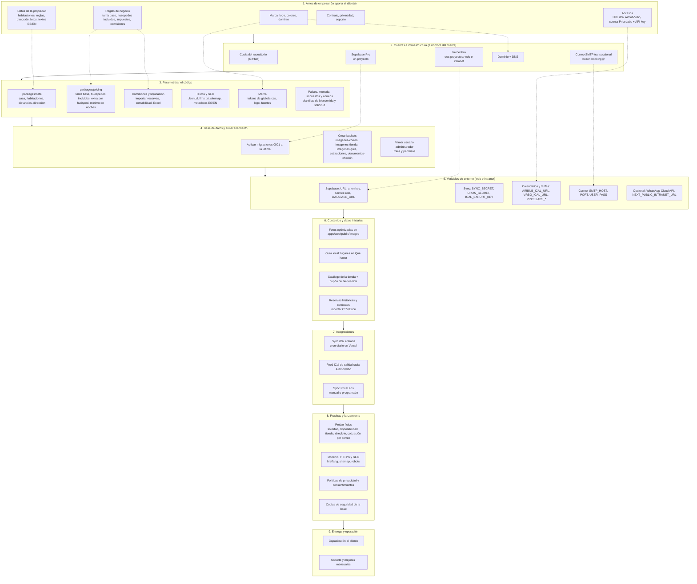

# Flowchart: qué se necesita para dar de alta a un cliente nuevo (web + intranet)

Fecha: 2026-10-05. Camino A de `docs/modelo-reventa-costos.md`: una instalación (copia) por cliente. Las rutas y nombres salen del repo actual; la lista de cosas específicas de Casa Randa sigue pendiente de auditar (paso 2 de ese documento), así que el bloque 3 es una primera lista, no definitiva.

## Lectura rápida
- Línea continua: el orden de las fases. Línea punteada: qué dato de una fase alimenta a cuál.
- Lo que el cliente debe tener antes de que empiece el trabajo: contrato, datos de la casa, accesos a Airbnb/Vrbo y PriceLabs, dominio. Sin eso, las fases 3 y 7 se bloquean.
- Lo más largo suele ser la fase 3 (parametrizar) y la 6 (fotos y textos); conviene medir las horas reales en el piloto.
