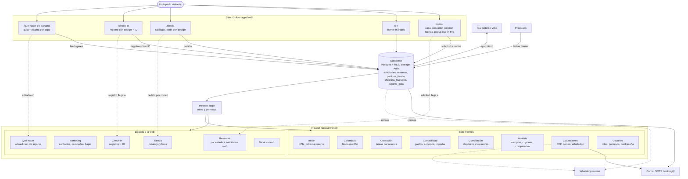

# Flowchart: sitio público, Supabase e intranet

Fecha: 2026-10-05. Mapa de cómo se conectan las páginas de `apps/web`, la base de datos y los módulos de `apps/intranet`. Detalle de cada pieza en `CLAUDE.md` y `docs/logica-negocio-y-flujos.md`.

## Lectura rápida
- Línea continua: flujo de datos. Línea punteada: relación con un módulo o un enlace externo.
- La web nunca habla con la intranet directamente: ambas leen y escriben en Supabase.
- No aparecen las rutas auxiliares: `/darse-de-baja`, `/restablecer-password` y `/que-hacer-en-panama/[slug]`.
