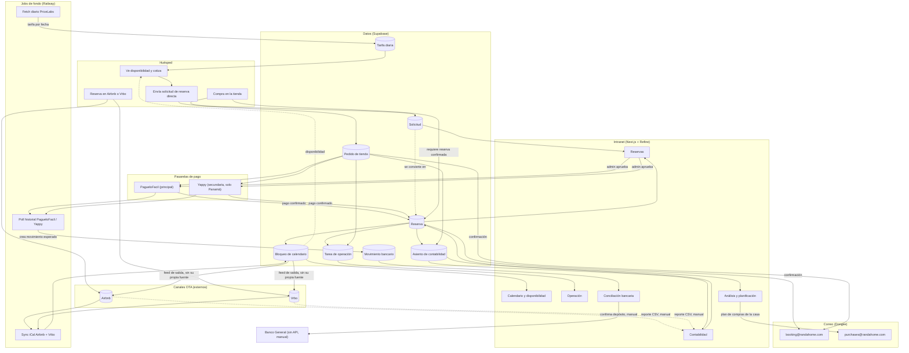

# Casa Randa — lógica de negocio, flujos e integraciones

> Documentado el 2026-09-11. Complementa [arquitectura-migracion.md](arquitectura-migracion.md) (qué herramientas usamos) con **cómo se conecta todo**: las entidades, los flujos de principio a fin, y el mapa de integraciones externas. Sin esto, el esquema de Supabase de la Fase 0 no se puede escribir con confianza.

## Diagrama completo (verificado que renderiza sin errores)



## Entidades (modelo de negocio, no el SQL todavía)

| Entidad | Campos clave | Notas |
|---|---|---|
| **Reserva** | canal (Airbnb/Vrbo/Directo), código externo, huésped, entrada, salida, noches, huéspedes, tarifa, bruto, comisión plataforma, recibido, comisión Marquelda, comisión Iván, neto, estado | El registro central. Todo lo demás cuelga de una reserva. |
| **Solicitud** (reserva directa antes de pagar) | datos del formulario, plan de tarifa, plan de pago, código de descuento, estado | Se **convierte en Reserva** cuando se aprueba y se confirma el pago — no antes. |
| **Bloqueo de calendario** | inicio, fin, fuente (Airbnb/Vrbo/Directo), reserva_id | La pieza que hoy falla (defecto D2): un bloqueo de fuente Directo debe sobrevivir a la resincronización y aparecer en los feeds de salida. |
| **Tarifa diaria** | fecha, tarifa, fuente (PriceLabs/plana), estancia mínima | La cotización la lee, no la inventa. |
| **Gasto** | fecha, categoría, concepto, proveedor, valor, medio de pago | Igual a lo que ya existe en Contabilidad. |
| **Anticipo de comisión** | persona (Marquelda/Iván), fecha, valor, referencia, motivo | Se descuenta contra la comisión acumulada del año. |
| **Movimiento bancario** | fecha, descripción, referencia, valor recibido, reserva/gasto relacionado, estado | Alimenta Conciliación bancaria. |
| **Tarea de operación** | reserva_id, tipo (preparación / turnover / limpieza de salida), estado | Se genera sola a partir de la Reserva — hoy ya son 3 tareas por estadía. |
| **Código de descuento** | código, % descuento, vigencia, máximo de usos, usos actuales | Aplica sobre la Solicitud antes de confirmar el pago. |
| **Plan de compras/mejoras** | año, categoría, concepto, proveedor, cotización, fecha programada, prioridad, estado | Alimenta Análisis y planificación. |
| **Producto de tienda** | nombre, descripción, precio, disponibilidad | Vino, café, desayuno, extras. |
| **Pedido de tienda** | reserva_id (**obligatorio**), productos, total, estado de pago, pasarela | Aprobado 2026-09-11: solo se compra con reserva confirmada, no hay compras anónimas. |
| **Usuario** | nombre, email, rol (administrador / dueño / empleado) | Mapea los tres paneles que ya existen en WordPress. |

## Flujo 1 — Reserva directa (la más nueva, la que no existe hoy en producción)

```
Huésped ve disponibilidad          lee blocked_ranges + daily_rates
        │
Cotiza en el sitio                 computeQuote() con tarifa dinámica
        │
Envía solicitud                    crea Solicitud, estado "pendiente"
        │
Aparece en Intranet → Reservas     como ya se ve hoy ("Solicitudes recientes")
        │                          + copia de aviso a booking@randahome.com
        │
Administrador aprueba
        │
Se genera link de pago              PagueloFacil (tarjeta) o Yappy (Panamá)
        │
Pago confirmado                     webhook si la pasarela lo da, si no,
        │                           consulta periódica a su historial de transacciones
        ▼
Solicitud → Reserva confirmada (canal="Directo")
        │                          + correo de confirmación desde booking@randahome.com
        ├──▶ blocked_range (source="Directo", reserva_id)
        │      → entra al feed de salida iCal hacia Airbnb Y Vrbo (arregla D2)
        │
        ├──▶ 3 tareas de Operación auto-generadas
        │
        └──▶ asiento de Contabilidad (bruto, comisión Marquelda, comisión Iván, neto)
        │
Yappy/PagueloFacil marcan el pago "procesado"     movimiento bancario esperado se crea solo
        │                                          (ver "Conciliación bancaria" más abajo)
Llega el depósito a Banco General
        │
Conciliación (confirmar que sí llegó — manual)    se cruza contra el movimiento esperado
        │
Cierre de mes                       liquidación Marquelda / Iván
```

**Lo único genuinamente nuevo respecto a hoy**: los pasos de solicitud→pago→confirmación. Todo lo que sigue después de "Reserva confirmada" ya existe y funciona en la intranet actual para reservas de Airbnb/Vrbo — solo hay que dispararlo también desde un pago directo.

## Flujo 2 — Reserva por Airbnb o Vrbo (ya funciona hoy, se mantiene igual)

```
Huésped reserva en la plataforma           (fuera de nuestro control)
        │
Job de sync trae el iCal                   cada N minutos/horas, Airbnb y Vrbo por separado
        │
blocked_ranges se actualiza                source = "Airbnb" o "Vrbo"
        │
Feed de salida se regenera                 el feed que ve Vrbo excluye lo propio de Vrbo,
                                            el que ve Airbnb excluye lo propio de Airbnb
                                            (evita el bucle de eco — el diseño actual ya es correcto)
        │
Admin importa CSV del reporte              upsert por código externo, no duplica
        │
Reserva + asiento de Contabilidad          igual que en el flujo directo
        │
Tareas de Operación auto-generadas
        │
Conciliación + cierre de mes
```

## Flujo 3 — Tienda (compra de extras antes de llegar)

```
Huésped con reserva confirmada entra a la tienda
        │
Elige productos (vino, café, desayuno)
        │
Paga (PagueloFacil principal, Yappy si es de Panamá)
        │
Pedido queda vinculado a la Reserva        (reserva_id obligatorio — sin reserva, no hay compra)
        │                                  + confirmación por correo desde booking@randahome.com
        │                                    (no purchases@ — ese correo es para compras
        │                                    de la casa, no para lo que compra el huésped)
        │
Aparece en Operación                       ("surtir despensa" antes del check-in)
        │
Ingreso entra a Contabilidad               como línea separada del alojamiento,
                                            para no distorsionar el cálculo de comisión de hospedaje
```

## Correo electrónico — aprobado 2026-09-11

Ya existen tres cuentas del dominio, alojadas en **Dongee**, y se van a usar tal cual — no se crea un dominio ni proveedor nuevo:

| Correo | Para qué | A qué flujo/entidad mapea |
|---|---|---|
| `booking@randahome.com` | Reservas | Notificación de Solicitud nueva (Flujo 1), confirmación de pago/Reserva (Flujo 1 y 2), confirmación de compra en la tienda (Flujo 3 — no `purchases@`, ver nota abajo) |
| `purchases@randahome.com` | Compras de la casa (elementos, muebles) | Correspondencia con proveedores del **Plan de compras/mejoras** (la entidad de capex, no la tienda del huésped) |
| `info@randahome.com` | Información general | Formulario de contacto/FAQ del sitio — no está ligado a ningún flujo transaccional de este documento |

**Nota importante:** `purchases@` y la tienda del huésped (Flujo 3) son cosas distintas que suenan parecido. `purchases@` es para cuando *la casa* compra algo (una trona, un detector de monóxido — lo que hoy se ve en Análisis y planificación → Plan de compras). Cuando el *huésped* compra vino o desayuno en la tienda, eso usa `booking@`, porque sigue siendo parte de su reserva. Vale la pena marcar esto explícitamente en el código para que nadie las mezcle.

**Cómo enviar (verificado por búsqueda, 2026-09-11):** Dongee ofrece correo normal (webmail/IMAP/SMTP) y, aparte, un servicio de **SMTP transaccional dedicado** (planes de 20,000 y 30,000 correos/mes). El envío masivo/automatizado **no está permitido** desde el SMTP de una casilla normal de hosting compartido — hay que usar el servicio dedicado para lo que la app envíe automáticamente (confirmaciones, avisos, liquidaciones).

Volumen estimado hoy (69 reservas/año ≈ 6/mes, más liquidaciones mensuales y confirmaciones de tienda): muy por debajo del plan más chico de Dongee SMTP. **Recomendación:** arrancar enviando desde el SMTP transaccional de Dongee — ya está pagado, alcanza de sobra, y no suma un proveedor nuevo. Si más adelante se necesita ver por qué un correo no llegó (webhooks de rebote, tasa de apertura, reintentos automáticos), ahí sí vale la pena evaluar Resend o Postmark — pero no hace falta decidirlo ahora.

## Mapa de integraciones externas

| Integración | Dirección | Qué mueve | Estado |
|---|---|---|---|
| iCal Airbnb | Entrada | Fechas bloqueadas por reservas de Airbnb | Ya funciona hoy |
| iCal Vrbo | Entrada | Fechas bloqueadas por reservas de Vrbo | Ya funciona hoy |
| Feed iCal de salida → Airbnb | Salida | Bloqueos de Vrbo + directos, sin los de Airbnb | Existe, pero sin las reservas directas (D2) |
| Feed iCal de salida → Vrbo | Salida | Bloqueos de Airbnb + directos, sin los de Vrbo | Existe, pero sin las reservas directas (D2) |
| PriceLabs API (`listing_prices`) | Entrada | Tarifa por fecha | Ya funciona hoy vía Casa Randa Puente |
| PagueloFacil | Salida/entrada | Cobro + API de transacciones | Por integrar — pasarela principal aprobada. Requiere pedir credenciales (CCLW + token) a PagueloFacil; falta confirmar si notifican por webhook o solo por consulta a su API |
| Yappy | Salida/entrada | Cobro + API de historial de transacciones | Por integrar — pasarela secundaria aprobada. Confirmado: tienen "History API" para consultar pagos y su estado (en tránsito / procesado), hasta 3 meses atrás |
| Banco General | — | Depósitos reales | **Sin API** — ver "Conciliación bancaria" abajo: se automatiza el lado esperado, no la confirmación del banco |
| Email transaccional | Salida | Solicitudes, liquidaciones, confirmaciones | **Resuelto** — Dongee (ver sección "Correo electrónico" arriba) |
| WhatsApp (Host Ivan) | — | Contacto con huéspedes | Mencionado en el sitio actual, no evaluado todavía |

## Conciliación bancaria — qué sí se puede automatizar sin la API del banco

Decidido 2026-09-11: no se integra la API de Banco General (no la vamos a usar); en su lugar, se aprovecha lo que **sí** exponen PagueloFacil y Yappy:

- **Yappy** confirma con su "History API": se puede consultar el historial de pagos y su estado — *"en tránsito"* (recibido, aún no procesado) o *"procesado"* (ya enviado al banco, llega en máximo 2 días hábiles). Eso alcanza para generar solo el **Movimiento bancario esperado** en cuanto Yappy marca el pago como procesado, sin que nadie lo escriba a mano.
- **PagueloFacil** también tiene una API de transacciones/reportes, pero hace falta pedir las credenciales (CCLW + token, se piden dentro de la cuenta de comercio) para confirmar si además avisa por webhook o si hay que consultarla por polling — pendiente de verificar cuando se abra la cuenta.

**Lo que sigue siendo manual, con o sin esto:**
1. Confirmar que el depósito **realmente llegó** al banco (comparar contra el estado de cuenta de Banco General) — sin API del banco, alguien lo revisa.
2. Toda la conciliación de pagos de **Airbnb y Vrbo**, que nunca pasan por PagueloFacil ni Yappy — esos llegan directo de la plataforma al banco, igual que hoy.

En resumen: se reduce la digitación manual para reservas directas y compras de tienda (que si pasan por PagueloFacil/Yappy), pero la conciliación no queda 100% automática — el defecto de fondo (no hay integración con el banco) sigue igual que en el sistema actual.

## Lo que todavía es una pregunta abierta

- **¿PagueloFacil avisa por webhook o hay que consultar su API periódicamente?** Se confirma al abrir la cuenta de comercio y pedir credenciales.
- **Todo el negocio opera en USD** — no se ha visto ninguna necesidad de multi-moneda; se asume que se mantiene así.

## Cómo se usa este documento

El esquema de Supabase (pendiente en `arquitectura-migracion.md`) se deriva directamente de la tabla de entidades de arriba. Con el correo, la conciliación y la regla de "tienda solo con reserva" ya decididos, lo único que falta antes de escribir el esquema es confirmar el detalle de webhook/polling de PagueloFacil.
